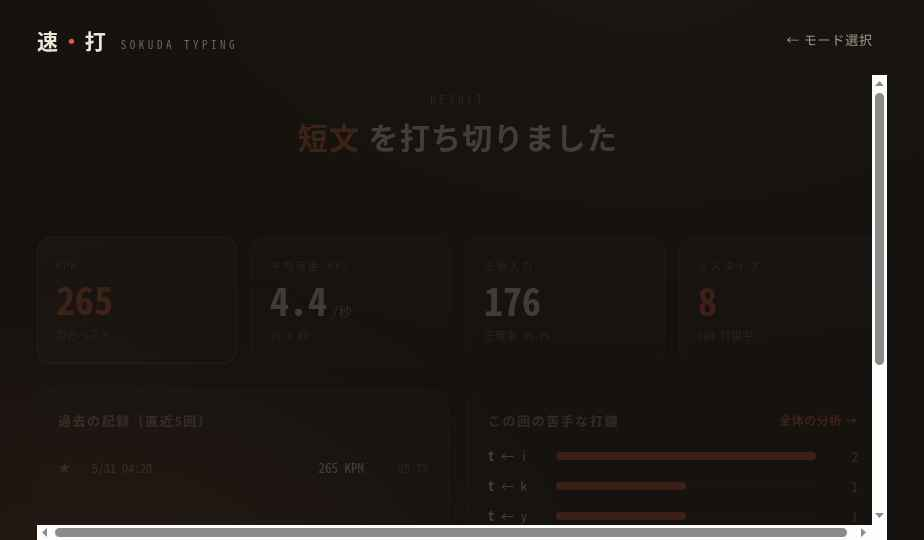
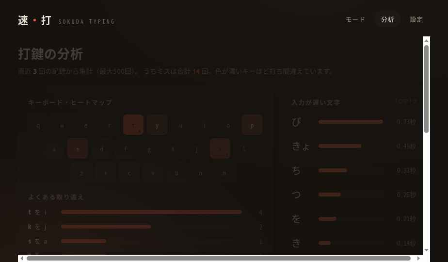

# 速・打 - タイピング道場

Soda Typing is an offline Electron typing practice app for Japanese kana-to-romaji input. It focuses on quiet practice, local records, and simple review tools without requiring a server.

## 概要

速・打は、ひらがなを見てローマ字で入力するデスクトップ向けタイピング練習アプリです。短文・中文・長文などのモードを選び、KPM、正確さ、ミス傾向をローカルに記録します。

データはブラウザ互換のローカルストレージに保存されます。サーバーや外部アカウントは使いません。

## スクショ






## 起動方法

必要なもの:

- Node.js
- npm

```bash
npm install
npm run build
npm start
```

`npm run build` は `src/` の JSX/JS/CSS から、Electron が読み込む `renderer/` を生成します。`renderer/` は生成物なので Git には含めません。

初回の `npm install` と `npm run build`（React・フォントの取り込み）はネットワークが必要です。ビルド後のアプリ本体はオフラインで動きます。

## 開発方法

主な構成:

- `src/`: 画面とロジックの元コード
- `build.js`: `src/` からオフライン実行用の `renderer/` を生成
- `main.js`: Electron のメインプロセス
- `docs/screenshots/`: README とポートフォリオ用の公開スクショ

変更したら次を実行します。

```bash
npm run build
npm start
```

## 実録データ

- 制作期間: 2026-05-31 から 2026-06-24
- 概算費用: ほぼ0円
- 使った AI / 道具: Claude、Codex、Electron、Babel、React
- 配布形態 v1: ソース公開と起動手順のみ。ビルド済みインストーラーは未提供

## 詰まった点と抜け方

- ブラウザ上の試作を、サーバー不要のデスクトップアプリとして動かす必要がありました。
  - `build.js` で JSX を事前コンパイルし、Electron が読む `renderer/` を生成する形にしました。
- 実行時に外部ネットワークへ依存しないようにする必要がありました。
  - React、ReactDOM、フォントを `renderer/` に同梱するビルド手順にしました。
- 既存の作業フォルダには開発用生成物や依存パッケージが含まれていました。
  - この公開リポジトリでは `node_modules/`、`renderer/`、`dist/` を除外し、再生成できる source だけを管理します。

## ライセンス

MIT License
